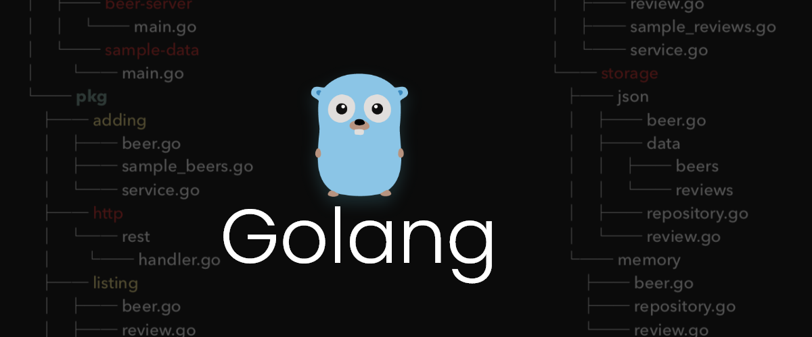
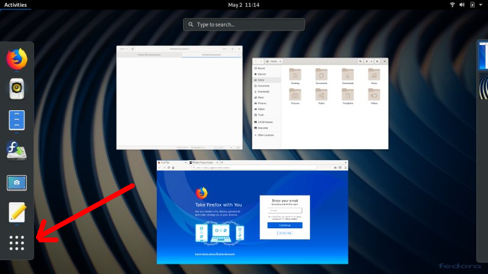
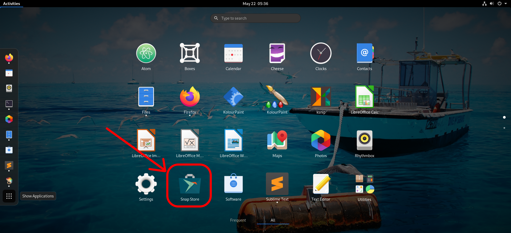
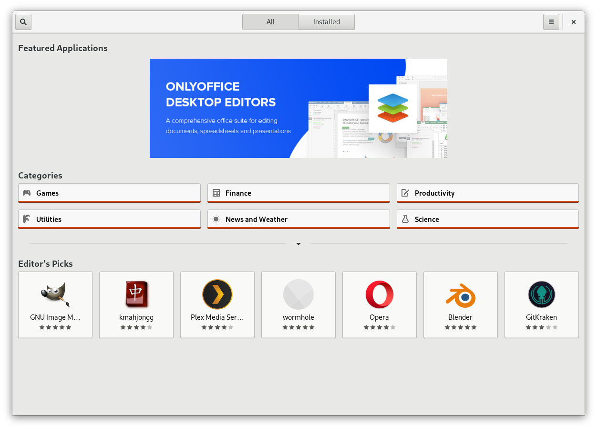
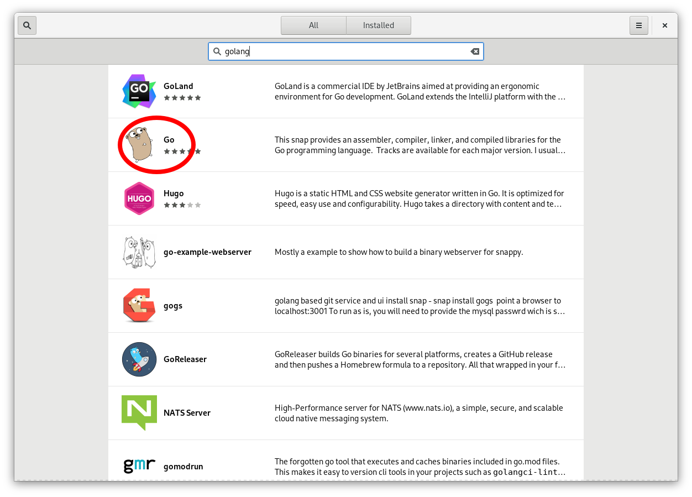
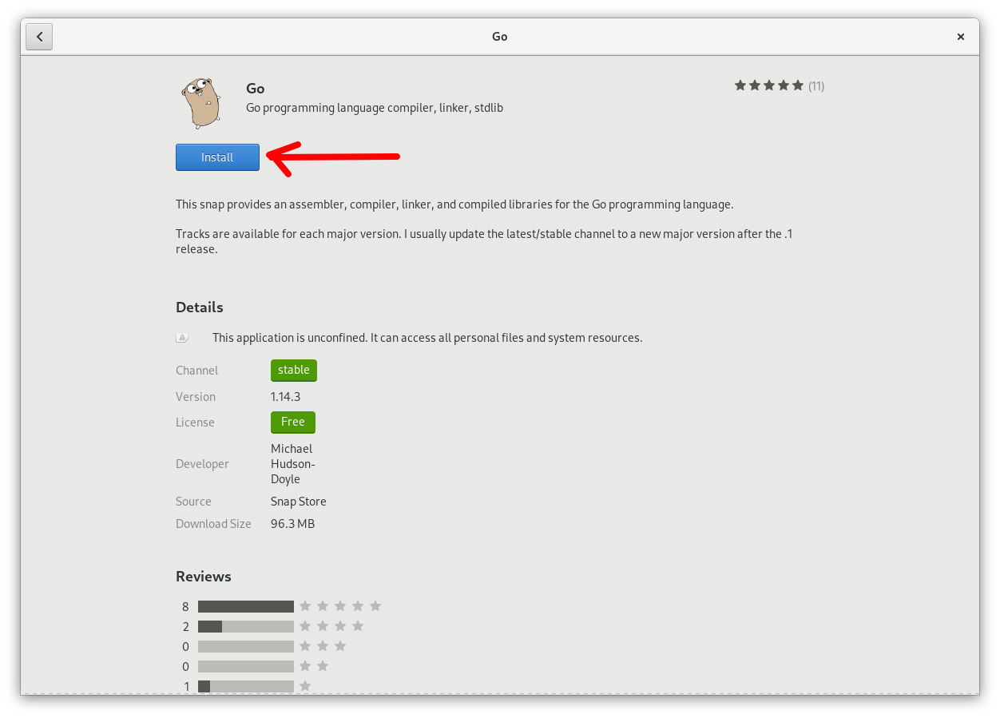

# Mustafa & Daddy hacking lessons ...

Hi buddy, this is Daddy writing to you. This web site will be the place to share with you all what I know about hacking so you can one day stop the hackers. 

## Let's start ...

First say Hi to Gopher, he is our friend who will be with us in learning GOLANG. 

Wait a minute, what is GOLANG? GOLANG is short for GO Programming Language. It is how people write instructions for the computer to run, people such as hackers and us who want to stop them. 

## First: install the tools we need

The tools we need are: 
1. **GOLANG compiler** (psst: compiler is kind of program that translates the commands we write into computer language)
2. **Text Editor**, this is a program that you use to write the program you want to run, such as the infinte loop 

### Installing GOLANG

First we click on **Activities** then we select the square with four dots like below 

Then we open __snap store__ like so 

Once the snap store open, you should see something like the following

go to the search bar like type __golang__

Hurray, you see, Gopher is there waiting for us 

Click on him and when he opens his page click on __install__ button like so. 

